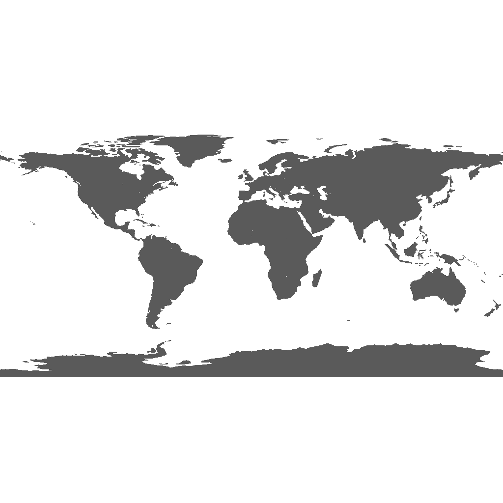
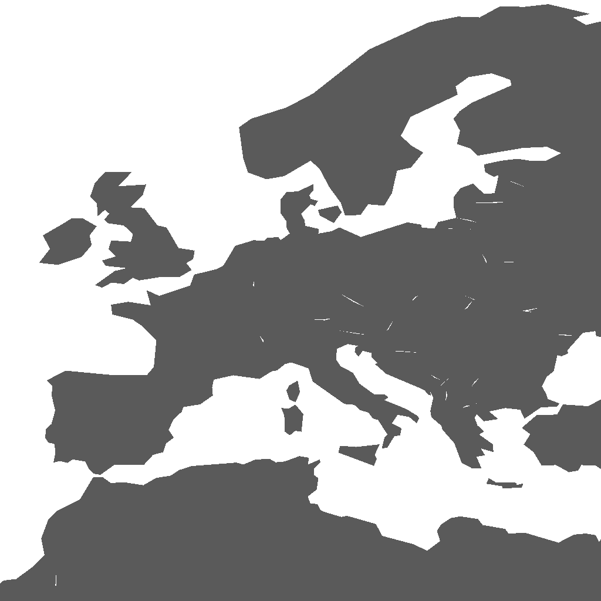
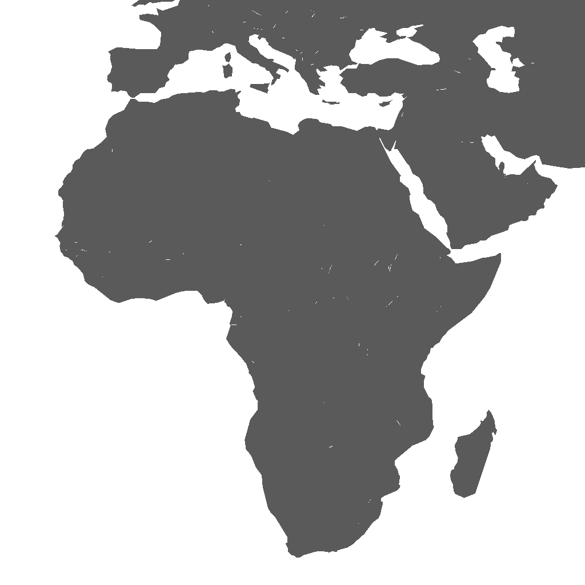
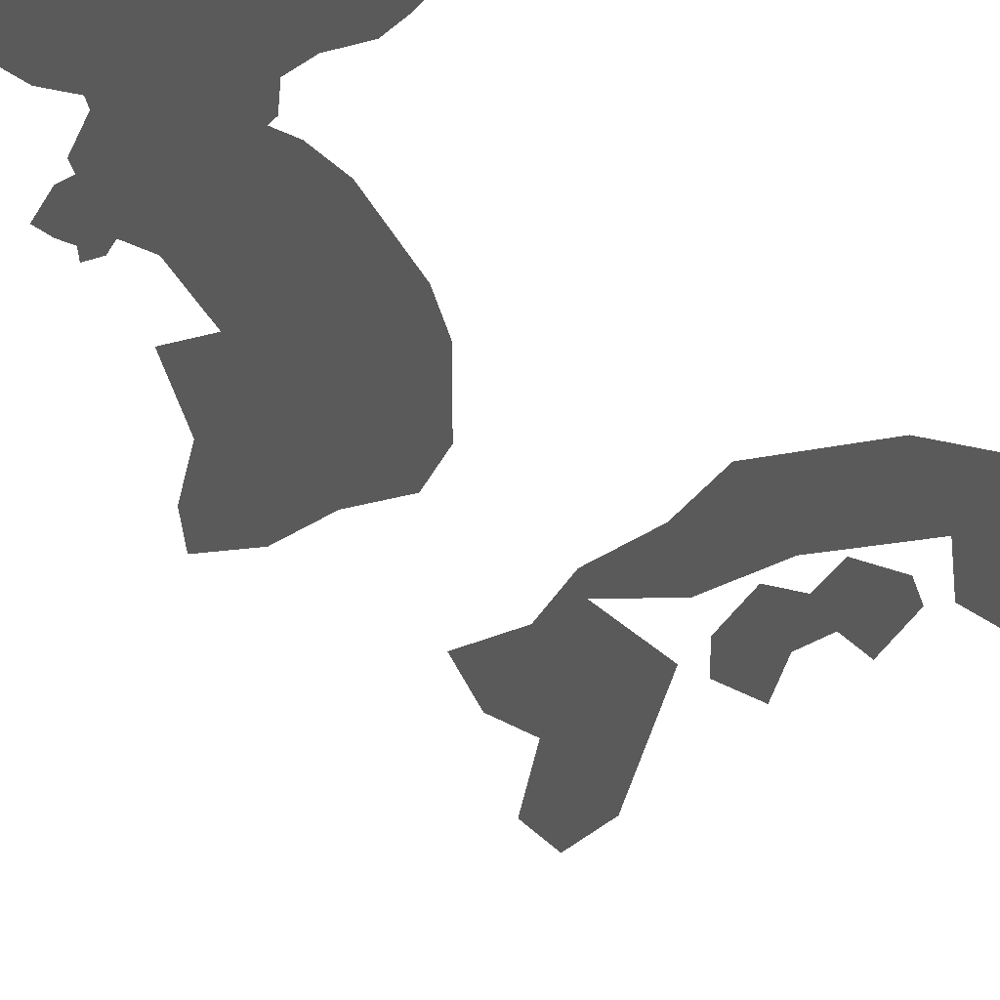

<!-- Generated from README.tmpl.md DO NOT EDIT -->

 

  

  <h3 align="center">tinygpkg-data</h3>

  

    Small, <a href="https://github.com/TWKB/Specification/blob/master/twkb.md">TWKB</a> compressed, and simplified <a href="http://www.geopackage.org/">GeoPackage</a> datasets to be used with <a href="https://github.com/SmilyOrg/tinygpkg-data/">tinygpkg</a>.
     
     
    <a href="https://github.com/SmilyOrg/tinygpkg-data/issues">Report Bug</a>
    ·
    <a href="https://github.com/SmilyOrg/tinygpkg-data/issues">Request Feature</a>
  

  
Table of Contents

  <ol>
    <li><a href="#about">About</a></li>
    <li><a href="#datasets">Datasets</a></li>
    <li><a href="#featured-variants">Featured Variants</a></li>
    <li><a href="#parameters">Parameters</a></li>
    <li><a href="#variants">Variants</a></li>
    <li><a href="#contributing">Contributing</a></li>
    <li><a href="#license">License</a></li>
    <li><a href="#acknowledgements">Acknowledgements</a></li>
  </ol>

## About

This repository contains a set of scripts and tools for generating [Tiny
Well-known Binary (TWKB)] compressed [GeoPackage] files from various open data
sources. Check out [Featured Variants](#featured-variants) or [releases] to
download the data or keep reading for more details and comparisons.

[releases]: https://github.com/SmilyOrg/tinygpkg-data/releases

## Datasets

| Name                          | Contents                                | Features | Source          | License                            |
| ----------------------------- | --------------------------------------- | -------: | --------------- | ---------------------------------- |
| [ne_110m_admin_0_countries]   | Country borders, 1:110m scale           |      177 | [Natural Earth] | [Public Domain][ne-license]        |

[ne_110m_admin_0_countries]: #ne_110m_admin_0_countries
[ne_10m_admin_0_countries]: #ne_10m_admin_0_countries
[ne_10m_urban_areas_landscan]: #ne_10m_urban_areas_landscan
[geoBoundariesCGAZ_ADM0]: #geoboundariescgaz_adm0
[geoBoundariesCGAZ_ADM2]: #geoboundariescgaz_adm2

[Natural Earth]: https://www.naturalearthdata.com/
[geoBoundaries]: https://www.geoboundaries.org
[ne-license]: https://www.naturalearthdata.com/about/terms-of-use/
[gb-license]: https://www.geoboundaries.org/index.html#citation

## Featured Variants

These are some selected useful variants of the datasets. See
[Variants](#variants) for the full list.

| Description                             | File                                                       | Size (vs. _source_) | Gzipped size (vs. _source_) |
| --------------------------------------- | -------------------------------------------------------------- | ---- | -------------- |
| **Country borders, tiny** | [📥 ne_110m_admin_0_countries_s4_twkb_p3](https://github.com/SmilyOrg/tinygpkg-data/releases/download/v0.1.0/ne_110m_admin_0_countries_s4_twkb_p3.gpkg) | **393 KB**   _46.9% of 838 KB_ | 96 KB   _51.4% of 186 KB_ |
| **Country borders, compatible** | [📥 ne_110m_admin_0_countries_s4_wkb](https://github.com/SmilyOrg/tinygpkg-data/releases/download/v0.1.0/ne_110m_admin_0_countries_s4_wkb.gpkg) | **520 KB**   _62.0% of 838 KB_ | 166 KB   _88.9% of 186 KB_ |

## Parameters

The `makevalid` variant is the original source file converted to [GeoPackage]
format using [ogr2ogr] with the `-makevalid` flag. This ensures a consistent
intermediary format with valid geometry that is then further simplified and
compressed.

Source datasets are minified using two methods, simplification and [Tiny
Well-known Binary (TWKB)][TWKB] compression.

Simplification is performed using the Ramer-Douglas-Peucker [Simplify] method on
the polygons. If the simplification fails (creates an invalid polygon), less and
less simplification is used until the polygon remains valid. If the polygon has
less than "Min. Points", it is not simplified.

Precision is the maximum number of decimal places used to store the coordinates
using [TWKB]. From empirical testing, less than 3 decimal places does not save a
lot of space and more than 3 decimal places does not gain a lot in precision for
these datasets.

The `wkb` variants are only simplified and not compressed, keeping the original
Well-known Binary (WKB) format. This increases compatibility with other tools at
the cost of larger file size.

| Name       | Simplify | Min. Points | Precision |
| ---------- | -------- | ----------- | --------- |
| makevalid  | none     | n/a         | full      |
| s3_twkb_p3 | 1        | 20          | 3         |
| s4_twkb_p3 | 0.1      | 20          | 3         |
| s5_twkb_p3 | 0.01     | 20          | 3         |
| s6_twkb_p3 | 0.001    | 20          | 3         |
| s7_twkb_p3 | 0.0001   | 20          | 3         |
| s8_twkb_p3 | 0.00001  | 20          | 3         |
| s3_wkb     | 1        | 20          | full      |
| s4_wkb     | 0.1      | 20          | full      |
| s5_wkb     | 0.01     | 20          | full      |
| s6_wkb     | 0.001    | 20          | full      |
| s7_wkb     | 0.0001   | 20          | full      |
| s8_wkb     | 0.00001  | 20          | full      |

[TWKB]: https://github.com/TWKB/Specification/blob/master/twkb.md
[Simplify]: https://pkg.go.dev/github.com/peterstace/simplefeatures/geom#Geometry.Simplify
[ogr2ogr]: https://gdal.org/programs/ogr2ogr.html

## Variants

These are the variants of the datasets available. Each variant is a combination of the parameters described above.

### ne_110m_admin_0_countries

Country borders, 1:110m scale sourced from [Natural Earth] ([Public Domain][ne-license]).

See [Parameters](#parameters) for what each variant means and
[Datasets](#datasets) for details on the dataset itself.

| Variant | Size |  world |  europe |  africa |  usa |  japan | 
| --- | --- |  --- |  --- |  --- |  --- |  --- | 
| [📥&nbsp;makevalid](https://github.com/SmilyOrg/tinygpkg-data/releases/download/v0.1.0/ne_110m_admin_0_countries_makevalid.gpkg) | 569 KB |  |  |  |  |  | 
| [📥&nbsp;s3_twkb_p3](https://github.com/SmilyOrg/tinygpkg-data/releases/download/v0.1.0/ne_110m_admin_0_countries_s3_twkb_p3.gpkg) | 352 KB |  |  |  |  |  | 
| [📥&nbsp;s4_twkb_p3](https://github.com/SmilyOrg/tinygpkg-data/releases/download/v0.1.0/ne_110m_admin_0_countries_s4_twkb_p3.gpkg) | 393 KB |  |  |  |  |  | 
| [📥&nbsp;s5_twkb_p3](https://github.com/SmilyOrg/tinygpkg-data/releases/download/v0.1.0/ne_110m_admin_0_countries_s5_twkb_p3.gpkg) | 393 KB |  |  |  |  |  | 
| [📥&nbsp;s6_twkb_p3](https://github.com/SmilyOrg/tinygpkg-data/releases/download/v0.1.0/ne_110m_admin_0_countries_s6_twkb_p3.gpkg) | 393 KB |  |  |  |  |  | 
| [📥&nbsp;s7_twkb_p3](https://github.com/SmilyOrg/tinygpkg-data/releases/download/v0.1.0/ne_110m_admin_0_countries_s7_twkb_p3.gpkg) | 393 KB |  |  |  |  |  | 
| [📥&nbsp;s8_twkb_p3](https://github.com/SmilyOrg/tinygpkg-data/releases/download/v0.1.0/ne_110m_admin_0_countries_s8_twkb_p3.gpkg) | 393 KB |  |  |  |  |  | 
| [📥&nbsp;s3_wkb](https://github.com/SmilyOrg/tinygpkg-data/releases/download/v0.1.0/ne_110m_admin_0_countries_s3_wkb.gpkg) | 409 KB |  |  |  |  |  | 
| [📥&nbsp;s4_wkb](https://github.com/SmilyOrg/tinygpkg-data/releases/download/v0.1.0/ne_110m_admin_0_countries_s4_wkb.gpkg) | 520 KB |  |  |  |  |  | 
| [📥&nbsp;s5_wkb](https://github.com/SmilyOrg/tinygpkg-data/releases/download/v0.1.0/ne_110m_admin_0_countries_s5_wkb.gpkg) | 557 KB |  |  |  |  |  | 
| [📥&nbsp;s6_wkb](https://github.com/SmilyOrg/tinygpkg-data/releases/download/v0.1.0/ne_110m_admin_0_countries_s6_wkb.gpkg) | 557 KB |  |  |  |  |  | 
| [📥&nbsp;s7_wkb](https://github.com/SmilyOrg/tinygpkg-data/releases/download/v0.1.0/ne_110m_admin_0_countries_s7_wkb.gpkg) | 557 KB |  |  |  |  |  | 
| [📥&nbsp;s8_wkb](https://github.com/SmilyOrg/tinygpkg-data/releases/download/v0.1.0/ne_110m_admin_0_countries_s8_wkb.gpkg) | 557 KB |  |  |  |  |  | 

## Contributing

Pull requests are welcome. For major changes, please open an issue first to
discuss what you would like to change.

## License

Code and tools distributed under the MIT License. The license of the datasets follows the license of the sources used to generate them. See [LICENSE.md](LICENSE.md) for more information.

## Acknowledgements
* [Best-README-Template](https://github.com/othneildrew/Best-README-Template)
* [readme.so](https://readme.so/)

[Tiny Well-known Binary (TWKB)]: https://github.com/TWKB/Specification/blob/master/twkb.md
[GeoPackage]: http://www.geopackage.org/
